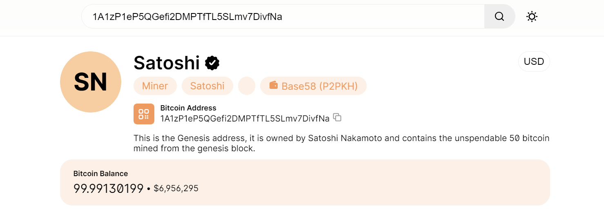

# 2024.05.23

블록체인에 대해서 아마도 제대로 이해하기에는 공부한 내용이 부족했던것이 아닐까...  
이런 이유로 조금 더 적어보려고 한다.

## Genesis block

- 블록체인에서 생성된 첫 번째 블록
- 제네시스 블록이 생성되었다는 것은 해당 블록체인 네트워크가 시작됨을 상징적으로 의미함

|  |
| :---------------------------------------------------: |
|     비트코인에 등록된 제네시스 블록을 확인한 모습     |

---

### 이더리움의 Genesis block

`이더리움`을 이용해서 네트워크를 시작할 때 사용되는 json 입니다.

```json
// Genesis.json
{
  "config": {
    "chainId": 789,
    "homesteadBlock": 0,
    "eip150Block": 0,
    "eip155Block": 0,
    "eip158Block": 0
  },
  "difficulty": "0x10",
  "coinbase": "0x0000000000000000000000000000000000000000",
  "gasLimit": "9999999",
  "alloc": {},
  "extraData": "",
  "nonce": "0xdeadbeefdeadbeef",
  "mixhash": "0x0000000000000000000000000000000000000000000000000000000000000000",
  "parentHash": "0x0000000000000000000000000000000000000000000000000000000000000000",
  "timestamp": "0x00"
}
```

항목 설명 :

- `config` : 블록체인의 구성을 정의하는 부분
  - `chainId` : 블록체인의 고유 ID
  - `homesteadBlock` : 블록체인의 릴리즈 버전
    아래의 세개는 Eips(Ethereum Improvement Proposals)의 특정 버전이 활성화 되는 블록 번호를 의미합니다..  
    다음 항목에 작성하는 숫자에 해당하는 블록부터 동일한 eip의 특정 버전의 기능이 활성화됩니다..
  - `eip150Block` : 가스 비용을 재조정하여 특정 연산에 대한 가스 비용을 증가시킴.
  - `eip155Block` : 트랜잭션 서명을 보호하기 위한 기능으로, `리플레이 공격`을 방지함.
  - `eip158Block` : 블록체인의 크기를 줄이기 위한 것으로, 특정 조건을 만족하지 않는 계정을 제거하는 상태 정리(state pruning)가 도입됨.
- `difficulty` : 새 블록을 **채굴**하는데 필요한 **난이도**
- `coinbase` : 채굴 보상을 받을 주소
- `gasLimit` : 블록당 가스 한도
- `alloc` : 특정 주소에 사전 할당된 이더
- `extraData` : 블록 헤더에 추가할 수 있는 데이터
- `nonce` : 블록 헤더의 nonce 값으로 채굴 과정에서 변경됨
- `mixhash` : 블록 헤더의 mixhash 값으로 채굴 과정에서 사용됨
- `parentHash` : 부모 블록의 해시로, genesis 블록의 경우 0
- `timestamp` : 블록이 생성된 시간으로, genesis 블록의 경우 0

- 리플레이 공격?
  > playback 공격이라고 도 불리며, 기존 코인과 하드포크로 인해 나오는 새로운 코인이 동일 인증키를 사용하기 때문에, 동일한 인증키를 통해 한 개의 코인출금 정보로 포크된/원본 즉 다른 한쪽의 출금 정보도 인출하려는 공격을 말한다.

## 채굴 ? ?

- 새로운 블록을 생성하는 과정 + 블록체인에 새로운 블록을 추가하는 과정

### 진행과정

1. 블록에 포함할 트랜잭션을 선택함 (아직 블록체인에 포함되지 않은 트랜잭션)
2. 선택한 트랜잭션을 블록에 포함시키고 블록 헤더를 생성함. 블록 헤더에는 이전 블록의 해시, 타임스탬프, nonce가 있음
3. 블록 헤더의 해시를 계산하고, 특정 조건을 만족하는지 확인함. 조건은 난이도에 의해 결정되는데 일반적으로 해시의 앞부분에 특정 개수의 0이 있어야 한다.
4. 해시가 조건을 만족하지 않는다면, nonce 값을 변경하고 다시 해시를 계산함. 해당 과정을 조건이 만족될 때 까지 반복
5. 해시가 조건을 만족하면 새로운 블록을 블록체인에 추가한다. 채굴자(계산자)는 채굴 보상을 받는다.

## 난이도 ? ?

새 블록을 채굴하는 데 필요한 작업의 양을 나타내는 값!  
난이도가 높을수록 채굴에 필요한 계산 작업이 더 많아진다.

난이도가 높을수록
블록 채굴과 조작이 어려워져 보안이 향상되지만,
컴퓨팅 리소스 증가로 채굴자에게 부담이 될 수 있다. 따라서 적절한 난이도를 설정해야 한다.

## Gas Limit :

1. 특정 블록에 포함될 수 있는 최대 가스의 양
2. 블록에 포함되는 복잡성과 양을 제한
3. 네트워크의 처리 용량을 의미하기도 함

알면 알수록 어려운 블록체인...  
프로젝트가 끝난겸 더 열심히 이것저것 공부해보겠습니다
