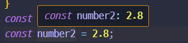
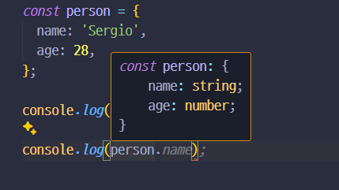

# 타입스크립트

## 타입스크립트 개요

참고로 일반 환경에서 안됨. - ts 는 컴파일러이기도 함.  
스크립트 실행 전 코드 오류 확인 기회가 생김  
기능 + 작업방식 + 에러체크

사용 이유 :
`console.log('1'+'2') = 12` 코드상 문제는 없지만, 기대한 기능은 아닐것임. 이러한 상황을 방지하는 장점으로 인해 사용됨

```js
function add(num1, num2) {
  return num1 + num2;
}
console.log(add(1, 2)); // 자스는 입력이 언제나 문자열임.
```

TypeScript 설치 :
`node`가 필요함! (npm)으로 받으니까!
`npm install -g typescript` 로 설치하자.

"+" 의 역할 ?

컴파일 해보기 :
`tsc 파일이름`

```ts
const button = document.querySelector("button")!;
const input1 = document.getElementById("num1")! as HTMLInputElement;
const input2 = document.getElementById("num2")! as HTMLInputElement;

function add(num1: number, num2: number) {
  return num1 + num2;
}

button.addEventListener("click", function () {
  console.log(add(+input1.value, +input2.value));
});
```

얘를 컴파일했더니~

이렇게 되었습니다.

```js
var button = document.querySelector("button");
var input1 = document.getElementById("num1");
var input2 = document.getElementById("num2");
function add(num1, num2) {
  return num1 + num2;
}
button.addEventListener("click", function () {
  console.log(add(+input1.value, +input2.value));
});
```

사용 의의 : 오류를 줄이고, 조금 더 확실한 타입으로 명확한 코드를 작성할 수 있게 된다.
참고로 런타임 상에서 오류를 잡아주는 것이 아닌 개발 단계에서 개입하여 잡는다는 생각을 하면 편하다. "실수를 알려준다"
: 잘못된 타입의 데이터가 사용되거나 전달되는지 탐지할 수 있으므로 예기치 않은 런타임 오류를 방지할 수 있다.

- js : 런타임 중 타입을 확인
- ts : 컴파일 중 타입을 확인
-

### ts의 특징 :

1. 타입을 작성한다. -> 타입을 통해 원하지 않는 기능 / 로직을 막는다.
2. IDE에서 자동 완성과 내장 에러를 미리 알려준다.
3. 컴파일 된 후 사용되므로((바벨처럼)) 자바스크립트를 사용하는 브라우저에서 쉽게 사용 가능하다.
4. js에는 없는 인터페이스, 제너릭 有
5. 데코레이터 등 지원한다.
6. 다양한 설정 옵션들
7. ts가 아닌 곳에서도 잘 지원한다.

vscode 확장 path intellisense

---

## 타입스크립트 시작!

## 중요한 타입

| 타입    |                  설명                   |
| :------ | :-------------------------------------: |
| number  |    소수점 유무, 정수 상관 X :: 숫자.    |
| string  |                 텍스트                  |
| boolean |              true / false               |
| object  |          js 객체, 특정한 객체           |
| Array   | js 배열, 배열의 타입은 유연 / 제한 가능 |
| Tuple   |           길이, 타입이 고정됨           |
| enum    |    ej) enum{NEW, OLD} : 열거된 목록     |
| Any     |      어떤 종류의 값이든 상관 없다.      |
| unknown | any보다 조금 나음. 타입체크는 함.|
|never | 
**타입스크립트의 주요 원시 타입은 모두 소문자!!!**

### 타입 추론

상수나 변수에 어떤 타입을 사용했는지 _제법_ 잘 이해한다고 생각하자.  
`이 친구 꽤나 멋진 친구라구요?`
ex:

```ts
const number = 5; // 타입스크립트가 어느정도 number라고 추론한다.
let number2 = 10; // 타입스크립트가 어느정도 number라고 추론한다.
```



따라서 이러한 코드가 있을 때 저런 값에도 일일히 타입을 작성하는 것은 그닥...  
=> 중복 작업이니까.

```ts
function add(n1: number, n2: number, showResult: boolean, phrase: string) {
  if (showResult) {
    const result = n1 + n2;
    console.log(phrase + result);
  } else {
    return n1 + n2;
  }
}
const number1: number = 5; // 이건 별로고
const number2 = 2.8; // 이게 낫다.
var number3: number; // 나중에 값을 할당하겠다면 이래도 됨

const printResult = true;

const resultPhrase = "Result is: ";
const result = add(number1, number2, printResult, resultPhrase);
```

타입 추론은 직접 타입을 할당하지 않아도 되게 함. 단 추론된 타입이 아닌 경우 에러가 발생한다.

```ts
let res = true;
res = 3; // 'number' 형식은 'boolean' 형식에 할당할 수 없습니다.
```

### 객체

객체 내부 요소도 추론되는 듯 하다. z

```ts
const person = {
  name: "Sergio",
  age: 28,
};
```

타입 스크립트가 추론한 객체 타입.


이렇게 객체의 정보를 줄 수도 있어요.

```ts
const person: {
  name: string;
  age: number;
} = {
  // 특정 객체 타입을 위한  {}를 사용
  name: "Sergio",
  age: 28,
};
```

  
잘 나옵니당 그런데 ts가 추론하도록 두는게 낫다고 합니다.

### 중첩된 객체 및 타입

js 예시:

```js
const product = {
  id: "닝닝닝닝",
  price: 12000,
  tags: ["멋진거", "돈까스"],
  details: {
    title: "뭔가뭔가",
    description: "멋진 돈까스!",
  },
};
```

이 객체의 타입은 다음과 같습니다.

```ts
{
  id: string;
  price: number;
  tags: string[];
  details: {
    title: string;
    description: string;
  }
}
```

### 배열

- JS 의 배열과 크게 다를 것은 없다!
- 배열 요소의 타입을 미리 정할 수 있다.
- `any`라는 타입도 있음. 어떤 타입이라도 들어갈 수 있음 : 하지만 "타입" 스크립트인데 타입을 굳이 뭉개버릴 이유가 있을까요?
-

```ts
let favouriteActivities: string[];
```

타입 추론 :

```ts
const person = {
  // 특정 객체 타입을 위한  {}를 사용 할 수 있다.
  name: "Sergio",
  age: 28,
  hobbies: ["Sports", "Running"],
};

let favouriteActivities: string[];
favouriteActivities = ["Sports", "Running"];
console.log(person.name);

for (const hobby of person.hobbies) {
  console.log(hobby);
}
```

이 경우에도 hobby의 요소가 String이라는 것을 알고, `String`에서 사용하는 요소들을 바로바로 보여준다. `map()`은 안되겠지만, `toUpperCase()`는 됨!!

### Tuple

`role: [2, 'author']` 이렇게 길이, 타입이 정확히 정해진 요소를 설정하고 싶을 때 사용할 수 있음. 가끔 추론이 잘 안될수도 있으니. 정확히 명시해보자.

```ts
const person: {
  name: string;
  age: number;
  hobbies: string[];
  role: [number, string];
} = {
  name: "Sergio",
  age: 28,
  hobbies: ["Sports", "Running"],
  role: [2, "author"],
};
```

- 하지만 push는 타입스크립트가 잡지 못하는 요소라서 어쩔 수 없음.
- 무엇이 들어갈수 있는지, 즉 입력받는 데이터 타입을 더 명확하고 정확하게 처리할 수 있다.

### enum:

예시

> // 관리자 0, 읽기전용 1, 작성자 2 : enum
> js에서는 상수를 설정해주는 것이 일반적이었지만. 모든 상수를 정의하고 관리해야 한다는 단점이 있다. `enum`으로 하면 더 쉬움  
> 즉 enum은 관련된 상수값들을 모아놓은 것입니다. 주로 대문자로 표기.

```ts
enum Role {
  ADMIN,
  READ_ONLY,
  AUTHOR,
}
// enum은 관련된 상수값들을 모아놓은 것이다.
// 관리자 0, 읽기전용 1, 작성자 2 : enum

const person = {
  // 특정 객체 타입을 위한  {}를 사용 할 수 있다.
  name: "Sergio",
  age: 28,
  hobbies: ["Sports", "Running"],
  role: Role.ADMIN, // enum member Role.ADMIN = 0 이렇게
};
```

---

enum을 선언할 때 따로 정의하지 않으면 0 부터 시작하고, 만약 특정한 값 , string을 원한다면 따로 정의해 줄 수 있습니다.

```ts
enum Role2 {
  ADMIN = 5,
  READ_ONLY = 100,
  AUTHOR = 200,
}
console.log(Role2.ADMIN); // 5
console.log(Role2.READ_ONLY); // 100
console.log(Role2.AUTHOR); // 200
```

위의 코드를 js로 컴파일하면 다음과 같아집니다.

```js
var Role2;
(function (Role2) {
  Role2[(Role2["ADMIN"] = 5)] = "ADMIN";
  Role2[(Role2["READ_ONLY"] = 100)] = "READ_ONLY";
  Role2[(Role2["AUTHOR"] = 200)] = "AUTHOR";
})(Role2 || (Role2 = {})); // console.log 는 제외했습니다.
```

이런 과정을 ts가 해주는거였네요! 바닐라로도 가능하겠지만 ts가 편하겠죠?

### Any

- "어떤" 타입입니다.
- 유현합니다
- 가능하다면 사용하지 않는 것을 추천. : ts 의 장점을 사용하지 못함. -> 바닐라 js랑 딱히 다를게 없으니까요!
- 진짜 뭐가 들어올지 모르는 데이터에 대해서 사용.
- **가능하다면 쓰지말자!!!!**


## 조합 타입 
```ts
// 변수: 타입1 | 타입 2
let input1: number | string
```
> 타입을 여러개 받을 수 있다는 것 일까? 
>
> 매개변수를 유연하게 받을 수 있다.
>
> 함수를 여러개의 타입으로 설정할 수 있다.
>
> 런타임 타입 검사가 필요할 수 있다.
```ts 
function combine(input1: number, input2: number) {
  const result = input1 + input2;
  return result;
}

const combinedAges = combine(30, 26);
console.log('combinedAges: ', combinedAges);

const combinedNames = combine('Max', 'Anna');
console.log('combinedNames: ', combinedNames);

```
이런 코드를 한번에 하고 싶은데 . . . . 지금은 combinedNames에서 에러가 난다!

따라서 아래와 같이 고쳐보자

```ts
function combine(input1: number | string , input2: number | string) {
  if (typeof input1 === 'number' && typeof input2 === 'number') {
    return input1 + input2;
  } else {
    return input1.toString() + input2.toString();
  }

}

const combinedAges = combine(30, 26);
console.log('combinedAges: ', combinedAges);

const combinedNames = combine('Max', 'Anna');
console.log('combinedNames: ', combinedNames);
```
둘다 숫자인 경우에는 런타임 타입 검사를 통해 숫자인 경우에는 두 수를 더하고,  
그렇지 않다면 두개를 문자열로 변경한 후, 합쳐줍니다.

### 리터럴 타입 
```ts
const n = 1.5 // number가 아니라, 1.5 로 정의됨. 값 자체가 해당 타입이라고 생각하면 되나
```
```ts
function combine(
  input1: number | string,
  input2: number | string,
  resultType: 'as-number' | 'as-text'
) {
  let res;
  if (typeof input1 === 'number' && typeof input2 === 'number' || resultType === 'as-number') {
    res =  +input1 + +input2;
  } else {
    res =  input1.toString() + input2.toString();
  }
  return res;
}

const combinedAges = combine(30, 26, 'as-number');
console.log('combinedAges: ', combinedAges);

const combinedNames = combine('Max', 'Anna', 'as-text');
console.log('combinedNames: ', combinedNames);

const combinedAgesText = combine('30', '26', 'as-number');
console.log('combinedAgesText: ', combinedAgesText);
```
- 두 개 이상의 값을 할
할당해줄 때.? 
만약 resultype이 as-text 혹은 as-number가 아니라면 에러가 날 것.

-  유니언 타입과 이용하면 좋음!!


### 타입 alias
보통 쓰기 전 파일 가장 상단에 type 키워드를 적어줌.
- 사용자 지정 타입 아닐까 싶음.
- 얘도 유니언 타입이랑 잘 쓰는 듯.
```ts
function combine(
  input1: number | string,
  input2: number | string,
  resultType: 'as-number' | 'as-text'
) {}
```

```ts
type Combinable = number | string;
type ResTypeDescriptor = 'as-number' | 'as-text'
function combine(
  input1: Combinable,
  input2: Combinable,
  resultType: ResTypeDescriptor
) {}
```
깔끔해진 모습 !

또한 객체 타입에도 별칭을 붙일 수 있다.
```ts
type User = { name: string; age: number };
const u1: User = { name: 'Max', age: 30 }; // this works!

function isOlder(user: { name: string; age: number }, checkAge: number) {
  return checkAge > user.age;
}

function isOlder(user: User, checkAge: number) {
  return checkAge > user.age;
}
```
이렇게 간단해질 수 있다는 말씀!


### 함수 반환 타입 & 무효? 
```ts
function add(n1: number, n2: number) {
  return n1+ n2;
}
// function add(n1: number, n2: number) :number  - ts는 이렇게 number가 나올 것이라고 반환값을 추론한다.
``` 
js에는 void가 없음. ts에서는 undefined를 반환중임...
다만 void 랑 undefined는 좀 다름
1. void
- 반환구문이 없다고 알려줌.
2. undefined 
- 이렇게 알아들음.
- 근데 굳이 이래야할까요?
- 알아서 잘 추론해요.
```ts
function A(i:any): undefiend {
  return;
}
```

### 타입의 기능을 하는 함수
```ts
let combineValues: Function;
combineValues= add;
combineValues = 5; // 위 Function이라 안됨.
```
조금더 자세히 저장해줍시다.
Function 타입은 함수를 정의하는 타입. 매개변수와 함수의 반환 값 까지 정의합니다.
Function 타입은 화살표로 만들어 줄 수 있읍니다.  
즉 어떤 매개변수를 받고, 무엇을 반환할 지 정의할 수 있습니다.

```ts 
let combineValues: () => number;
```   
이제는 number만을 반환하는 함수를 받으라고 알려줬습니다.

조금 더 자세히 알려줘봅시다.  
```ts
let combineValeus: (a: number, b: number) => number;
```
<details>
<summary>
함수 타입 관련 코드블록
</summary>

```ts
function add(n1: number, n2: number) {
  return n1+ n2;
}

// function add(n1: number, n2: number) :number  - ts는 이렇게 number가 나올 것이라고 반환값을 추론한다.

 function printResult(num: number):void {
  console.log('Result: ' + num);
}

printResult(add(5, 12));


let combineValues: (a: number, b: number) => number;
combineValues= add;
// combineValues = 5; // 위 Function이라 안됨.
// combineValues = printResult; // a,b 두개의 인자가 필요한데 하나만 넣었기 때문에 안됨.
console.log(combineValues(8, 8));
```

</details>

콜백도 정의 가능함!
```ts
function addAndHandle(n1: number, n2: number, cb: (num: number) => void) {
  const result = n1 + n2;
  cb(result);
}

addAndHandle(10, 20, (result) => {
  console.log(result);
});
```
타스는 매개변수에는 매우 엄격하지만, 반환값에는 그렇게 엄격하지는 않습니다. 

###  unknown
: 아직 모르는 것.
오류 없지 잘 저장할 수 있음!! 하지만 `any`와는 다름.  
`any`는 타입 체크 자체를 안합니다. 
하지만 `unknown`은 타입 체크는 합니다. 따라서 어떤 타입을 저장하지는 모르지만 무엇을 할 지는 알고있는 상태.

### never 
: **절대 반환 안함**
```ts
function generateError(message: string, code: number) {
  throw {message: message, errorCode: code}
}
```
